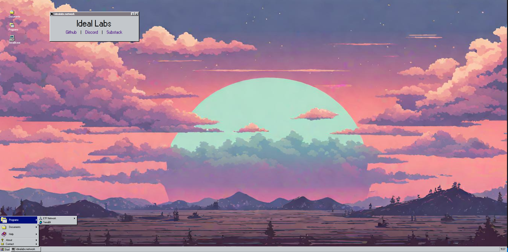

# The Bull Marketing Company Website

Welcome to The Bull Marketing Company's official website repository! If you're here, you're either a true crypto marketing degen or just curious about how the bulls run the show. Either way, strap in and get ready to go full bull!

[Visit our website](https://bullmarketingco.com)

## Built with 🛠️

- [React95](https://github.com/React95/React95) - Because why not bring back some 90s nostalgia while we pump your brand to the moon?



## Why Choose Us?

Are you tired of mediocre marketing strategies? Want to take your crypto brand to the next level? Look no further!

### Meme Maxis

We're not just another marketing company. We're meme maxis. We create viral campaigns that make your brand unforgettable.

### AI-Powered

Our cutting-edge AI analyzes trends and optimizes your reach, ensuring you always stay ahead of the curve.

### Go Full Bull

We believe in going full bull or nothing at all. If you're not with us, you're clearly missing out.

## Our Philosophy

- **Be Alpha, Get Alpha**: We don't just follow trends; we set them. Choose rich, choose us.
- **Pre-rich**: Our clients are always on the verge of greatness. Don't be left behind.
- **Bulls Only**: Our community is exclusive, and only the boldest brands make the cut.
- **That's Bear Talk**: If you're here talking bear, you're in the wrong place. We're all about the bulls.

## Getting Started

Want to run our awesome website locally? Here's how you can do it:

### Prerequisites

Make sure you have [Node.js](https://nodejs.org/) installed.

### Installation

1. Clone the repo:

   ```bash
   git clone https://github.com/yourusername/the-bull-marketing-company.git
   cd the-bull-marketing-company
   ```

2. Install NPM packages:

   ```bash
   npm install
   ```

3. Run the development server:

   ```bash
   npm run dev
   ```

4. Open your browser and visit:
   ```
   http://localhost:3000
   ```

## Contributing

We welcome contributions from fellow degens! If you have a great idea or found a bug, feel free to submit a pull request or open an issue.

## License

Distributed under the MIT License. See `LICENSE` for more information.

---

Built with ❤️ by The Bull Marketing Company. Remember, **choose rich**, choose us!
